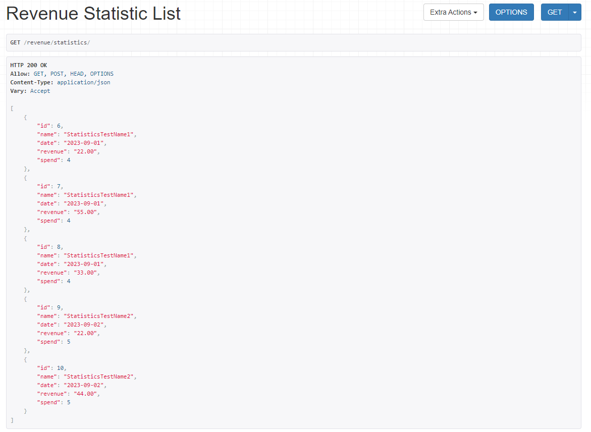

## Results of implementation of the test task

1. General revenues list
```commandline
http://127.0.0.1:8000/revenue/statistics/
```


2. General spends list
```commandline
http://127.0.0.1:8000/spend/statistics/
```


3. Revenues list with aggregation by date & name
```commandline
http://127.0.0.1:8000/spend/statistics/
```

4. Spends list with aggregation by date & name
```commandline
http://127.0.0.1:8000/spend/aggregate-by-date-name/
```
